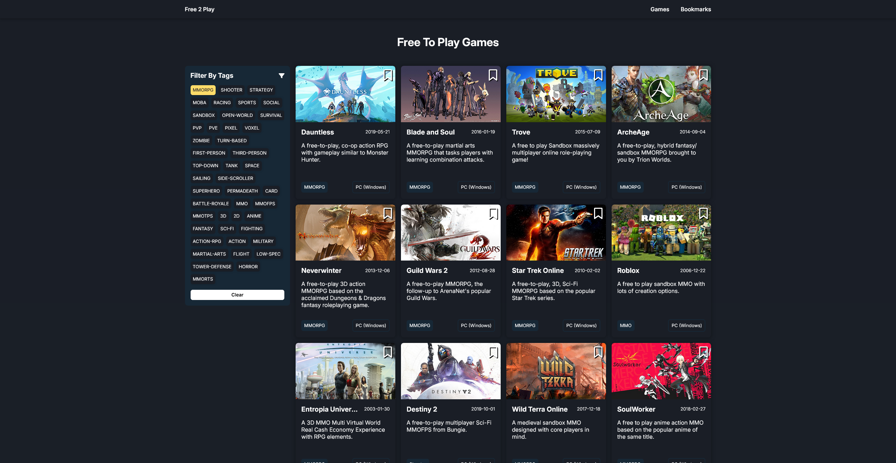
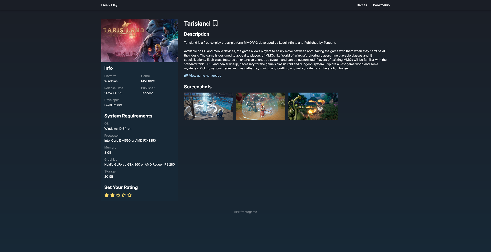
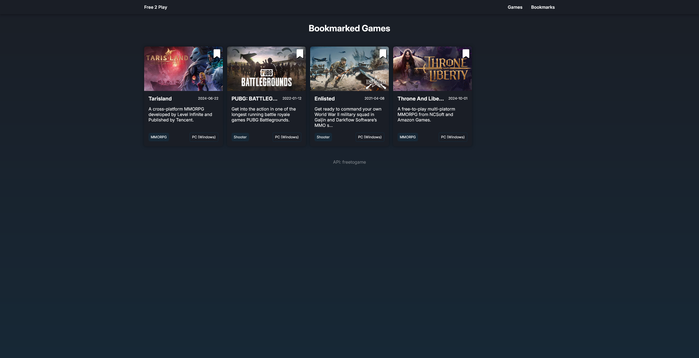
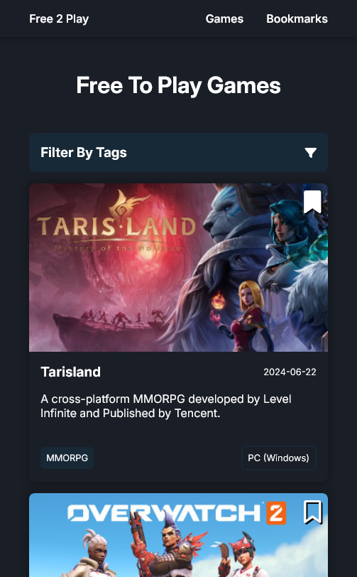
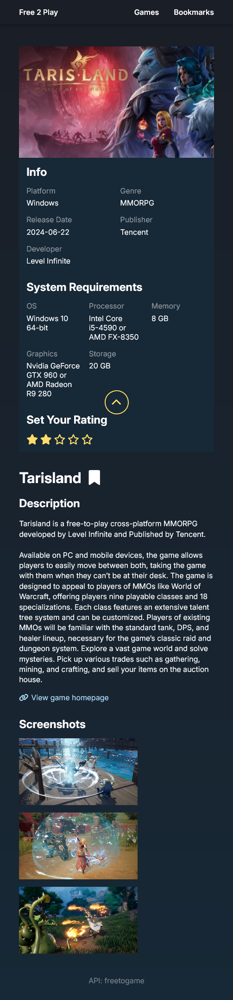
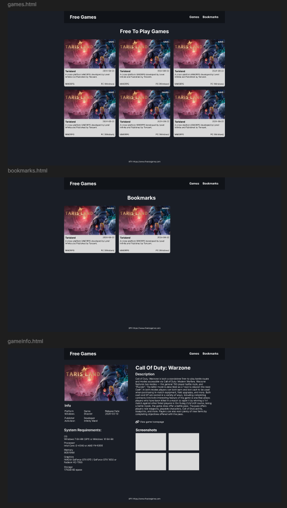

# Individual Project: CRUD-application with localStorage

Unfortunately I hade to use an API key for this project, meaning I could not publish it on github pages, and viewing the project locally requires you to setup your own API key (a key can be acquired here: https://rapidapi.com/digiwalls/api/free-to-play-games-database). Below I've instead got some screenshots of what the page looks like, as well as a gif that shows how the site works. Although the gif is quite small so it's a bit hard to see.

**Features**
- List of all games on the landing page.
- Filter games by tags.
- Add/remove bookmarks by clicking the bookmark icon.
- Click a game to be redirected to a page with more detailed game information.
- Add/update your rating for a game by clicking the stars on game details page.

## Gif

## Screenshots
### Desktop

### Responsive

  
  

## Basic Figma Wireframe

Quick layout to know roughly how I wanted it to look.

https://www.figma.com/design/54U3GRoLp1l4R453KPgk1w/Untitled?node-id=0-1

## API Used:

https://www.freetogame.com/api-doc